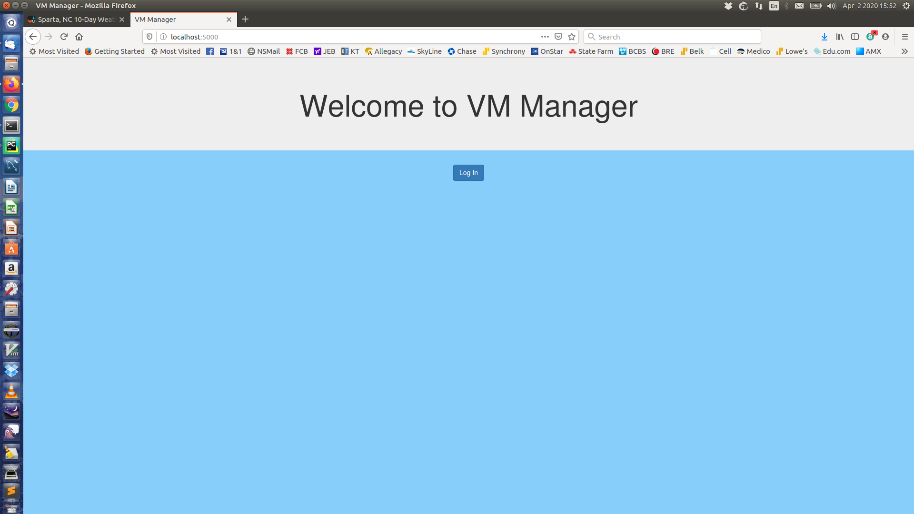

==========
VM Manager
==========

:VM Manager:    Training Project for Vigilant Cyber Systems
:Development:   https://github.com/leetuckert10/VMManager

What
----

"VM Manager" is a custom training project conceived by Vigilant Cyber
Systems. The project has little real world value but was a good exercise
for introduction to Flask, HTML, Pamariko, MySql, and other libraries used
in its development.

It was developed using Python 3.7. The IDE used was PyCharm.

Installation
------------

Since this project was never deployed to any working environment because
it was never intended for that purpose, there are no specifiic installation
instructions. It does require MySQL and screen shots of the database
structure are available in the presentation directory. The project never left
the virtual environment of PyCharm. It certainly can be installed and used
simply by having the required modules installed and having the database set up.

Use
---

The purpose of the program is to manage, to some small degree, virtual
machines, or any other host for that matter. It uses Pamariko for host
connection with connection information being stored in the database. At
this time, the application only works with linux derivatives, a major
flaw.

There is a presentation of how to use the program along with application
setup and an overview of the internal operation of the program. It is in odt
format.

The user interface and operation of the application are very simplistic
due to the fact that this is the first web application ever written by
the developer.

